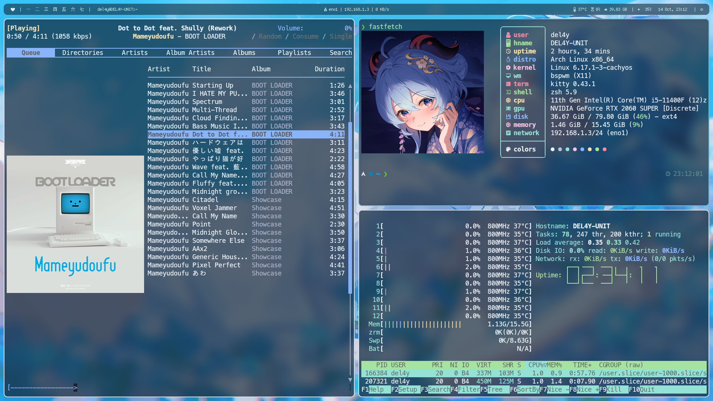

To install this bspwm config, run the following command:
```shell
cp -rv ~/dotfiles/bspwm_backup/* ~/.config/
```
To set wallpaper, use feh: 
```shell
feh --bg-fill /path/to/your/wallpaper
```
If you use xorg-xinit, to start the session:
```shell
startx
```
Autostart X when logging in from TTY:
```shell
## .zprofile file
if [ -z "$DISPLAY" ] && [ "$XDG_VTNR" = 1 ]; then
  exec startx
fi
```

**Make sure that you have installed all the required dependencies**

## Dependencies

* **WM:** bspwm
* **Bar:** polybar
* **Shortcuts:** sxhkd (check .config/sxhkd/sxhkdrc for kb shortcuts, Win + enter to open the terminal)
* **Launcher - Powermenu:** rofi
* **Screenshot**: scrot (Win/Super+shift+S to capture on selection, PrintScr to capture the entire screen, Ctrl+PrintScr to capture active windows)
* **Compositor:** picom
* **Notification Daemon:** dunst
* **Terminal:** kitty (main), urxvt, urxvt-perls (for kb shortcuts)
* **Sysmon:** htop
* **Sysfetch:** fastfetch
* **Wallpaper:** feh
* **Fonts:** cozette-otb, ipa-fonts
* **Shell:** zsh (ohmyzsh, zsh-autosuggestions, zsh-syntax-highlighting, zsh-completions, powerlevel10k)
* **Lockscreen:** betterlockscreen

```shell
yay -Sy bspwm polybar rofi scrot sxhkd picom dunst rxvt-unicode urxvt-perls htop feh cozette-otb ipa-fonts noto-fonts zsh betterlockscreen fastfetch thunar thunar-volman thunar-archive-plugin polkit polkit-gnome dbus gnome-keyring tumbler ffmpegthumbnailer gvfs lxappearance xorg-server xorg-xinit xorg-xsetroot xclip cmus mpd mpc rmpc kitty lsp-plugins easyeffects pipewire pipewire-audio pipewire-alsa pipewire-pulse pipewire-jack
```

```shell
# Optionally install x11libre-server instead of the normal X server
sh -c "$(curl -fsSL https://x11libre.net/repo/arch_based/x86_64/install-xlibre.sh)"
```

### Screenshots




